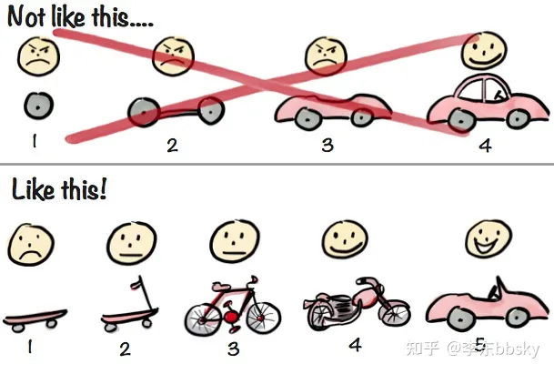

# 理论

## MVP

> abbr. 最小化可行产品（Minimum Viable Product）
> abbr. 最简化可实行产品（Minimum Viable Product）

先把最简单但又是最核心的功能给做出来上线了再说，正如以下配图里面，你要开发一个代步工具，就不要想着一上来就做一个“大东西”，把啥功能都往里面塞，而是要小步迭代。

## 前端跨平台

> 前端跨端实践可以通过响应式设计、PWA、Hybrid App 开发、微信小程序开发以及使用跨平台框架等技术来实现。
> Finclip / Flutter / Taro / React Native / Weex / Rax / Electron

1. 响应式设计（Responsive Design）：通过使用 CSS 媒体查询和弹性布局等技术，可以根据设备的屏幕大小和分辨率来自适应地调整页面布局和样式，从而在不同的终端上提供良好的用户体验。
2. Progressive Web Apps（PWA）：PWA 是一种使用现代 Web 技术开发的应用程序，它能够像原生应用一样提供离线访问、推送通知和设备硬件访问等功能。PWA 可以运行在各种平台上，包括桌面浏览器、移动浏览器和操作系统。
3. Hybrid App 开发：Hybrid App 是指结合了 Web 技术和原生应用技术的应用程序。通过使用框架如 React Native、Flutter 等，开发人员可以使用 HTML、CSS 和 JavaScript 来构建应用程序，并将其封装为原生应用以在不同平台上运行。
4. 微信小程序（或其他类似平台）开发：微信小程序是一种在微信生态系统内部运行的应用程序。开发者可以使用基于 HTML、CSS 和 JavaScript 的开发框架，如 Taro 等，来跨平台开发小程序，并在微信平台上发布和分发。
5. 跨平台框架（Cross-platform Framework）：跨平台框架允许开发人员使用统一的代码库来构建可以运行在多个平台上的应用程序。一些知名的跨平台框架包括 React Native、Flutter、Ionic 等，它们提供了丰富的组件和 API，同时支持多个平台，如 iOS、Android 和 Web。
